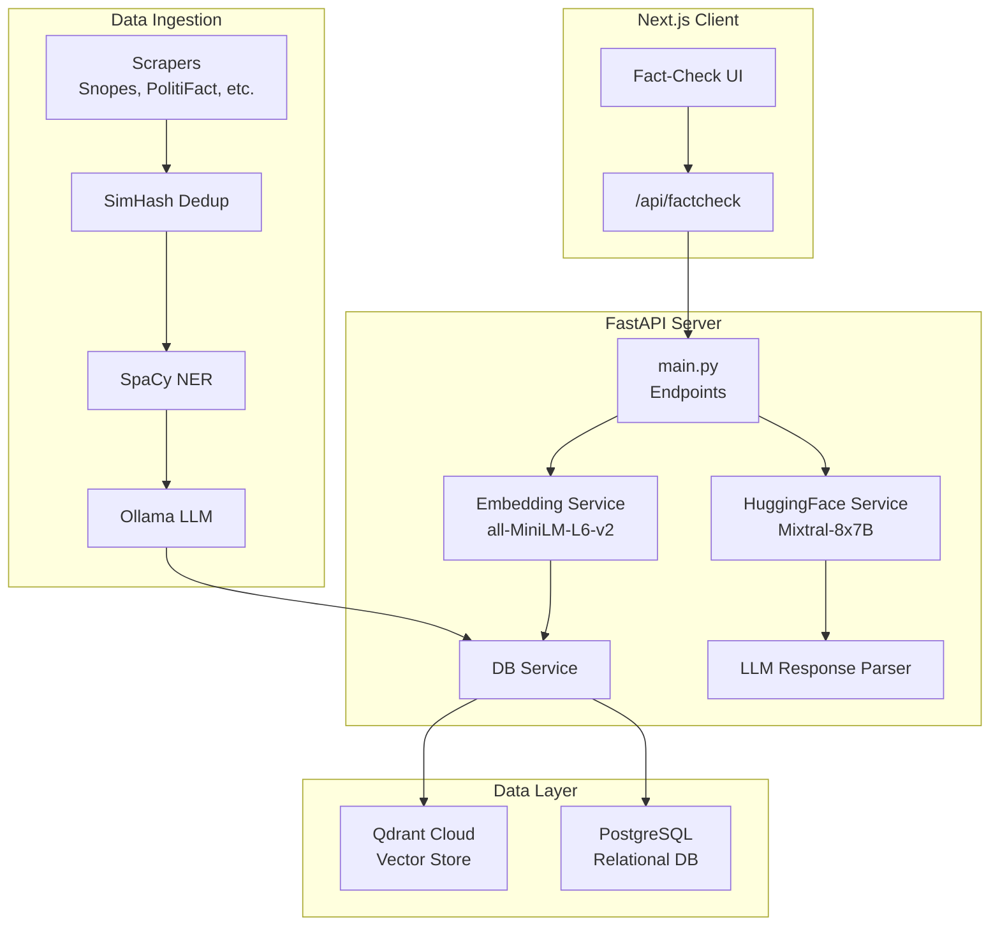
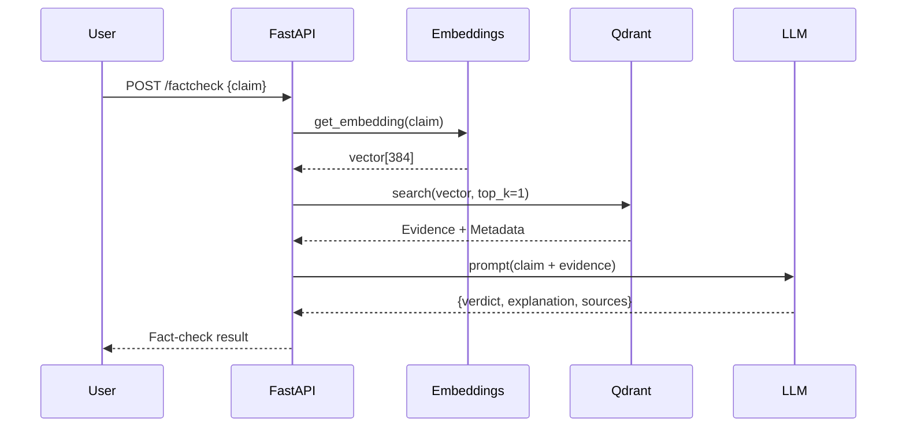
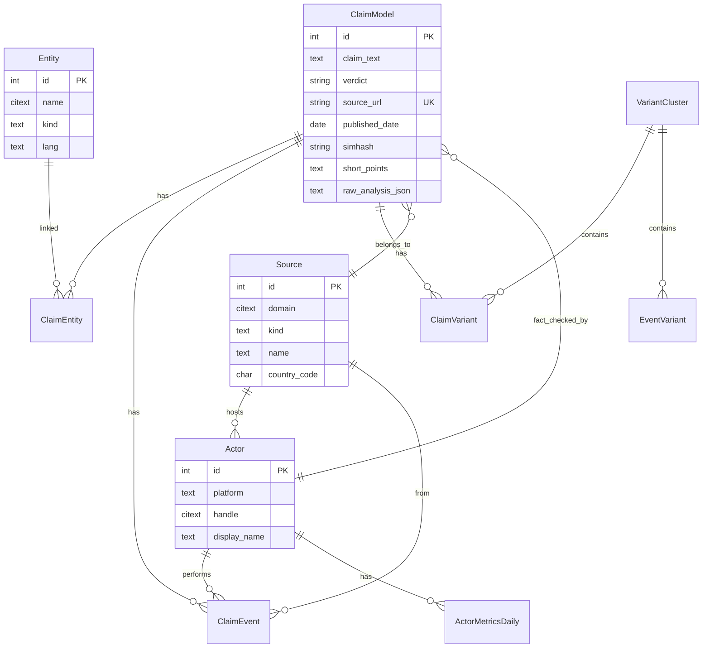
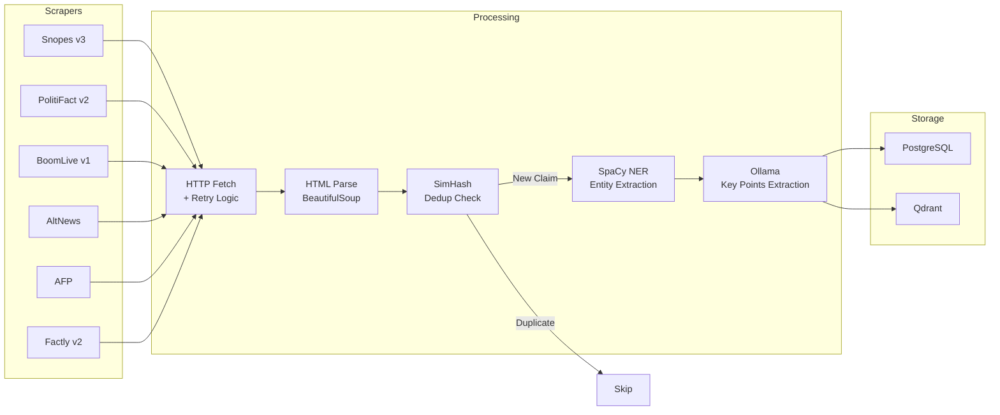
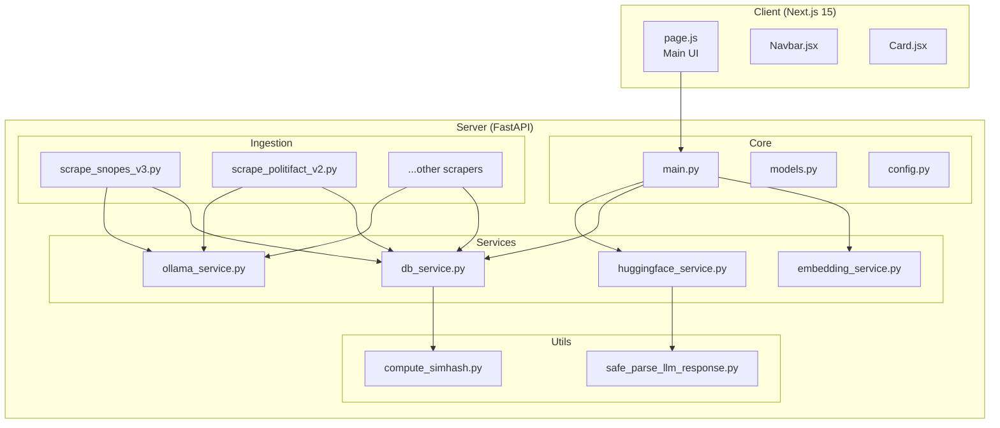

# Architecture

This document describes the system architecture of Veritium, an AI-powered fact-checking platform using Retrieval-Augmented Generation (RAG).

## System Overview

## RAG Pipeline

The fact-checking flow follows the standard RAG pattern:

### 1. Embedding Generation
- Model: `all-MiniLM-L6-v2` from Sentence Transformers
- Output: 384-dimensional vectors
- Optimized for semantic similarity

### 2. Vector Search
- Qdrant Cloud with COSINE distance
- Returns top-K most similar fact-checked claims
- Payload includes: `text`, `verdict`, `source_url`, `date`, `short_points`

### 3. LLM Verdict Generation
- Model: `mistralai/Mixtral-8x7B-Instruct-v0.1`
- HuggingFace Inference API
- Structured JSON output with verdict, explanation, sources

## Database Schema

### Core Models

| Model | Purpose |
|-------|---------|
| `ClaimModel` | Fact-checked claims with verdicts and metadata |
| `Source` | Origin domains (fact_checker, news, social, etc.) |
| `Actor` | Users/organizations that share or check claims |
| `Entity` | Named entities extracted via NER (person, org, place) |
| `ClaimEvent` | Claim lifecycle events (said, shared, debunked) |
| `VariantCluster` | Groups of semantically similar claims |
| `ScraperRuns` | Ingestion job tracking |

## Ingestion Pipeline

### Deduplication Strategy

- **SimHash Fingerprinting**: 64-bit fingerprint per claim
- **Hamming Distance Threshold**: ≤ 2 bits = near-duplicate
- Applied before insertion to prevent redundant data

### Entity Extraction

SpaCy NER maps to custom entity kinds:
- `PERSON` → `person`
- `ORG` → `org`
- `GPE` → `place`
- Others → `topic`

## Component Diagram

## Technology Decisions

| Decision | Rationale |
|----------|-----------|
| **Qdrant over Pinecone** | Self-hostable, gRPC support, rich filtering |
| **Mixtral over GPT-4** | Open weights, cost-effective, good instruction following |
| **SimHash over exact match** | Detects paraphrased duplicates efficiently |
| **SpaCy for NER** | Fast, local, no API costs for entity extraction |
| **Alembic migrations** | Versioned schema changes, rollback support |

## Scaling Considerations

1. **Vector Search**: Qdrant supports sharding and replication
2. **Database**: PostgreSQL connection pooling with pgBouncer
3. **Embeddings**: Batch encoding for ingestion pipelines
4. **Rate Limiting**: Scraper throttling to respect source sites
5. **Caching**: Redis for LLM response caching (future)
